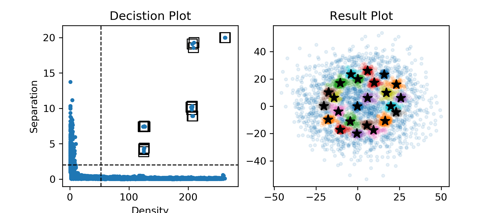
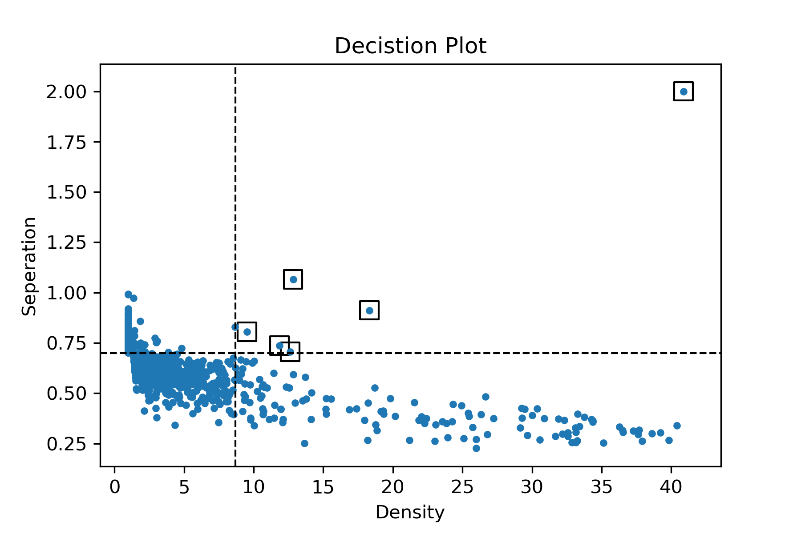
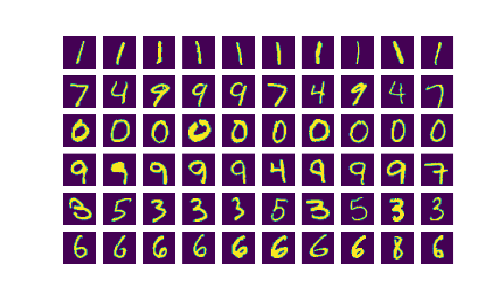
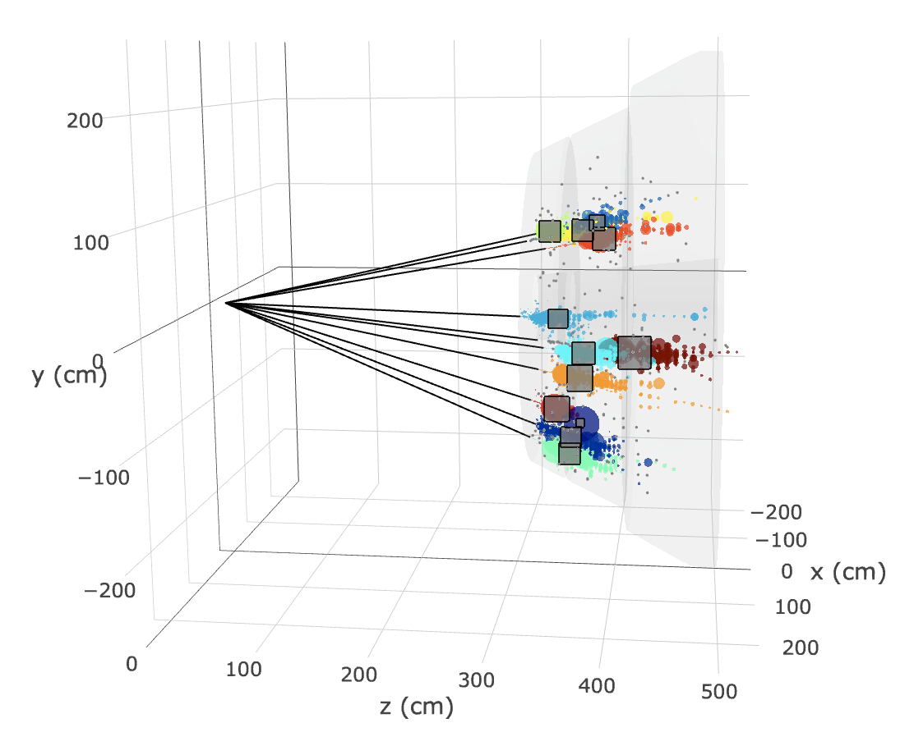

# ImageAlgorithm


Image Algorithm is a clustering algorithm based [fast search and find of density peaks](http://science.sciencemag.org/content/344/6191/1492). 
Comparing with other popular clustering methods, such as DBSCAN,  one of the most prominent advantages of Image Algorithm is being highly parallelizable.

This Repository is an implementation of Image Algorithm, supporting strong GPU acceleration. For now, the implementation includes three backends: numpy, CUDA and OpenCL.

| backend | dependency | Support Platform | Support Device |
| :---: | :---: | :---: | :---: |
| [`numpy`](http://www.numpy.org) | None | Mac/Linux/Windows | CPU |
| [`CUDA`](https://en.wikipedia.org/wiki/CUDA) | pycuda | Linux | Only NVIDIA GPU |
| [`OpenCL`](https://en.wikipedia.org/wiki/OpenCL) | pyopencl | Mac | NVIDIA/AMD/Intel GPU, multi-core CPU |

It has been tested that all three backends give the identical clustering results. Therefore users can feel free to choose whichever faster and easier for their purposes. Concerning speed performace, acceleration from CUDA/OpenCL may give an up to x20 speed up from CPU when dealing with more than a few thousands of data points. A preliminary speed test of three backends can be found [here](https://galleryziheng.wordpress.com/2017/12/08/gpu-acceleration-of-imaging-algorithm).


## Quick Start
No dependency is required for numpy backend. And it usually does a good job dealing with small dataset. However, for users wanting to use GPU acceleration with either CUDA or OpenCL backend, extra dependency is required. 
```bash
# if want to use opencl backend
pip install pyopencl
# if want to use CUDA backend
pip install pycuda
```

The primary usage of the module is the following
First of all, import ImageAlgo class for K-Dimension
```python
from ImageAlgoKD import *
```

Declare an instance of ImageAlgoKD with your algorithm parameters. Then give it the input data points.
```python
ia = ImageAlgoKD(MAXDISTANCE=20, KERNEL_R=1.0)
ia.setInputsPoints(Points(np.genfromtxt("../data/basic.csv",delimiter=',')))
```

Then run the clustering over input data points.
```python
ia.run("numpy")
# ia.run("opencl") or ia.run("cuda") if want run in parallel
```

In the end, the clustering result can be access by
```python
ia.points.clusterID
```

## Examples

#### I. Basic
Perform IA clustering on 1000 toy 2D points, sampled from two Gaussian Distrituion and noise.
<p align=center></p>
The toy data is in `/data/basic.csv`, while the corresponding jupyter notebook can be found [here](/example/example_basic.ipynb) in `/examples/`.

#### II. MNIST
Perform IA clustering on 1000 MNIST 28x28 dimension points. 
<p align=center> 
   
  
</p> 
The MNIST data is in `/data/mnist.csv`, while the corresponding jupyter notebook can be found [here](/example/example_mnist.ipynb) in `/examples/`.

#### III. HGCal
This is an 300GeV pion with PU200 event in CMS HGCal. This event includes about 200k HGVCal reconstructed detector hits, which is input into IA clustering.

<p align=center></p> 

For this example, an 3D interactive visualization can be found [here](https://plot.ly/%7Ezihengchen/18/#/)

