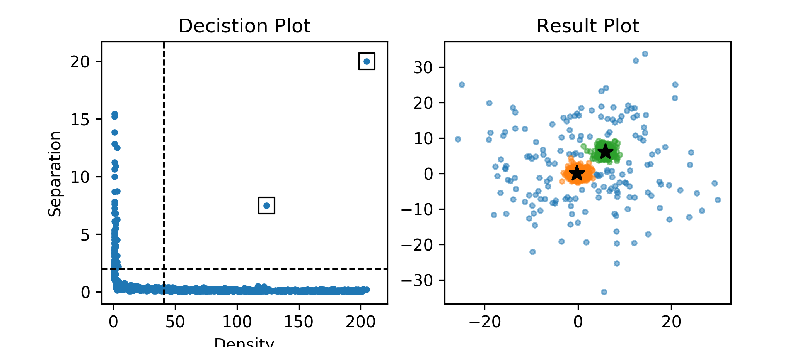

# ImageAlgorithm


# ImageAlgorithm

Image Algorithm is a clustering algorithm based [fast search and find of density peaks](http://science.sciencemag.org/content/344/6191/1492). 
Comparing with other popular clustering methods, such as DBSCAN,  one of the most prominent advantages of Image Algorithm is being highly parallelizable.

This Repository is an implementation of Image Algorithm, supporting strong GPU acceleration. It has three backends, [numpy](http://www.numpy.org), [cuda](https://en.wikipedia.org/wiki/CUDA), [openCL](https://en.wikipedia.org/wiki/OpenCL).

| backend | dependency | Support Platform | Support Device |
| --- | --- | --- | --- |
| numpy | None | Mac/Linux/Windows | CPU |
| CUDA | pycuda | Linux | NVidia GPU |
| OpenCL | pyopencl | Mac | NVidia/AMD/Intel GPU, multi-core CPU |

It has been tested that all three backends give the identical clustering results. Therefore users can feel free to choose whichever backend faster and easier for their purpose. Concerning speed, acceleration from CUDA/OpenCL can give an up to x20 speed up when dealing with more than a few thousands of data points. A preliminary speed test of three backends can be found [here] (https://galleryziheng.wordpress.com/2017/12/08/gpu-acceleration-of-imaging-algorithm/).


## Quick Start
No dependency is required for numpy backend. For small dataset, this usually does a good job. However, for users wanting to use GPU acceleration with either CUDA or OpenCL backend, extra dependency is required. 
```bash
# if want to use opencl backend
pip install pyopencl
# if want to use CUDA backend
pip install pycuda
```

The primary usage of the module is the following
import ImageAlgo class for K-Dimension
```python
from ImageAlgoKD import *
```

Declare an instance of ImageAlgoKD with your algorithm parameters. Then give it the input data points.
```python
ia = ImageAlgoKD(MAXDISTANCE=20, KERNEL_R=1.0)
ia.setInputsPoints(Points(np.genfromtxt("../data/basic.csv",delimiter=',')))
```

Then run the clustering over input data points.
```python
ia.run("numpy")
# ia.run("opencl") or ia.run("cuda") if want run in parallel
```

In the end, the clustering result can be access by
```python
ia.points.clusterID
```

## Examples

#### Basic
<p align=center></p>
